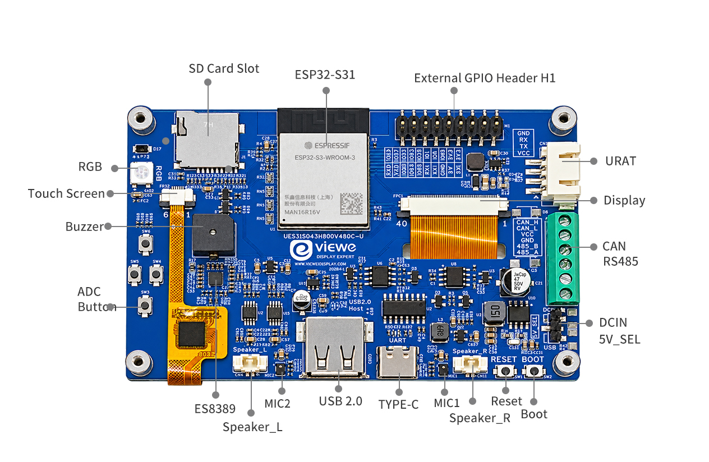
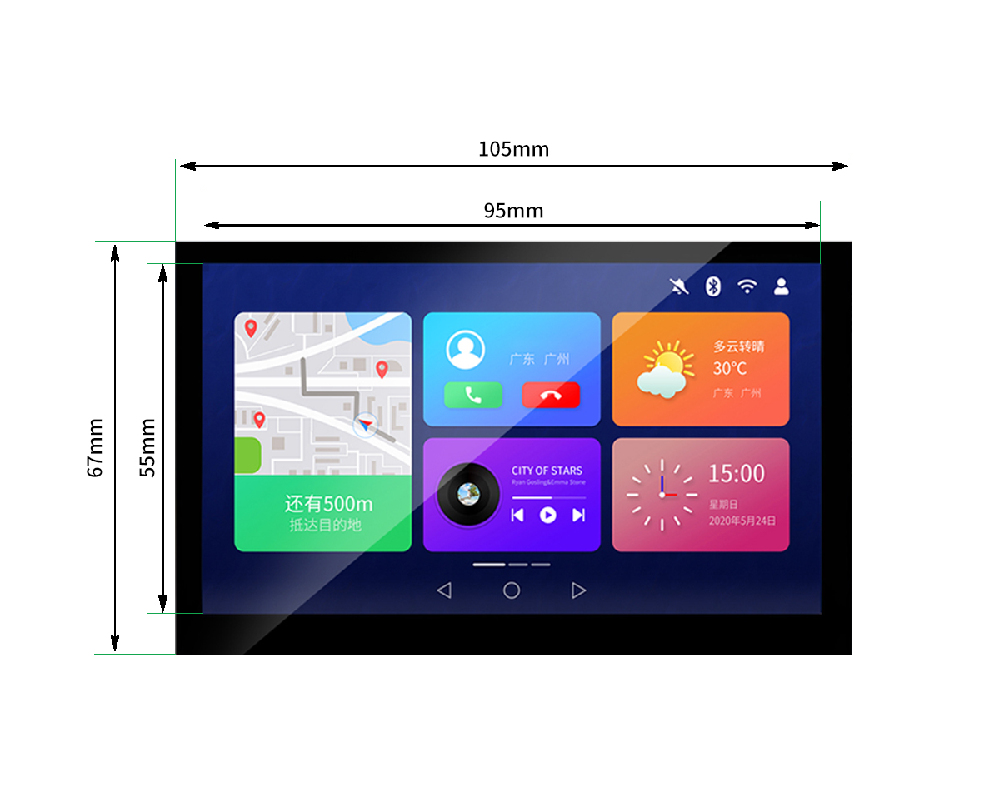

<h1 align="center">VIEWE 4.3" 800×480 ESP32-S31 Smart Display Quick Guide</h1>

* **[中文版](./README_CN.md)**

<p align="center">
    
</p>

---

## 1. Introduction

PLCM-UES31S043H800V480C-U is a high-performance smart display module designed by VIEWE. It is based on the Espressif ESP32-S31-WROOM-3 module and a 4.3-inch RGB capacitive touch panel (800 × 480). The LCD and touch devices are the same as those used on UEDX80480043E-WB-B (ST7262 driver IC and GT911 CTP). The main board is a new design around ESP32-S31: a dual-core 32-bit RISC-V MCU running at up to 320 MHz, with Wi-Fi 6, Bluetooth 5.4 (LE) plus Bluetooth Classic, USB 2.0 High-Speed OTG, stereo audio, SDIO 3.0 storage, and RS485 / CAN industrial interfaces.

> [!NOTE]
> ESP32-S31 is a preview device. ESP-IDF builds must use the `--preview` option (for example `idf.py --preview set-target esp32s31`). Module ratings follow the Espressif ESP32-S31-WROOM-3 datasheet (pre-release). The example guides in this repository say stable releases such as 5.4 or 5.5 do not include this chip, and that ESP-IDF **master** is required.

### 1.1 Product Features

**CPU:**
- **Processor**
  - ESP32-S31 RISC-V 32-bit dual-core processor, main frequency up to 320 MHz, plus a ULP-RISC-V coprocessor.
  - 2.4 GHz Wi-Fi 6 (IEEE 802.11b/g/n/ax, HT20/40, up to 150 Mbps), Bluetooth 5.4 LE (including LE Audio), Bluetooth Classic (BR/EDR), and IEEE 802.15.4 (Zigbee / Thread).
  - On-module PCB antenna.
  - Hardware security: Secure Boot, Flash/PSRAM encryption, cryptographic acceleration, and TEE. See the chip datasheet for details.
- **Memory**
  - On-chip: 320 KB ROM, 512 KB SRAM, 32 KB low-power SRAM.
  - Typical module configuration on this product: 16 MB Quad SPI Flash + 16 MB Octal SPI PSRAM (ESP32-S31-WROOM-3-N16R16V).
  - Flash and PSRAM can be accessed in parallel.
- **Peripheral Interfaces**
  - USB Type-C port for 5 V power, firmware download, and serial debug (CH340C bridged to UART0).
  - USB Type-A port connected to the dedicated USB 2.0 High-Speed OTG PHY (USB_DP / USB_DM, not GPIOs). Host 5 V is sourced through TPS2051C (~500 mA). VBUS-EN is hard-wired high and is not MCU-controlled.
  - On-board MicroSD slot, 4-bit SDMMC / SDIO 3.0.
  - ES8389 stereo codec, dual NS4150B speaker amplifiers, dual analog microphones, and L/R speaker connectors.
  - RS485 (SIT3088E, hardware automatic direction) and CAN (SIT1050T + on-chip TWAI) on a 6-pin terminal.
  - 2 × 10 pin 2.54 mm header (H1) bringing out UART0/UART1, I2C, RS485/CAN GPIOs, 3.3 V / 5 V / GND.
  - Four ADC keys, RESET / BOOT, WS2812B RGB LED, and a 3 kHz passive buzzer.

For more information on ESP32-S31-WROOM-3, see the module datasheets under [Related Documents](#5-related-documents).

**Display:**
- Size: 4.3 Inch
- Resolution: 800 × 480
- Pixel Arrangement: RGB Vertical Stripe
- Interface Mode: 40PIN RGB 24bits
- Driver IC: ST7262E43-G4
- Touch IC: GT911
- Brightness: 400 cd/m²
- Touch: CTP
- Verified timing: PCLK 18 MHz, negative polarity; HSYNC 1 / 40 / 20; VSYNC 1 / 10 / 5
- Panel in the product specification: IPS TFT, active area 95.04 mm × 53.86 mm, module power 1.04 W typical, 16.2M colors

**Other:**
- Operation Temperature: −20 ~ 70 °C (limited by the LCD)
- Storage Temperature: −30 ~ 80 °C
- MCU module rating: −40 ~ 85 °C
- Power voltage: 5.0 V typical
- Operating current (VCC = +5 V): 320 mA typical / 500 mA maximum at maximum backlight; 100 mA typical with backlight off
- Recommended power supply: 5 V 1 A DC

### 1.2 Applications

The product specification lists these application areas:

- Smart Home Control Panels
- Industrial Automation HMI
- Smart Appliances
- Consumer Electronics
- Wireless Data Loggers
- Touch Screen Interfaces
- Educational Learning Platforms

### 1.3 Product Naming

| Field | Code | Meaning |
| --- | --- | --- |
| Form | PLCM | PCB + LCM (Display) |
| Brand / series | UE | VIEWE smart display module |
| MCU | S31 | ESP32-S31-WROOM-3 |
| Size | S043 | 4.3 inch |
| Resolution | H800V480 | 800 × 480 |
| Touch | C | Capacitive (GT911) |
| Bus | U | UART / RS485 / I2C / CAN / USB 2.0 High-Speed OTG |

---

## 2. Product information

### 2.1 Interface Description




1. **Main control module:** ESP32-S31-WROOM-3. Dual-core RISC-V, up to 320 MHz, 16 MB Flash + 16 MB PSRAM, PCB antenna.
2. **Display interface:** 40-pin RGB output. The panel is 24-bit capable; this board wires RGB666 (R2–R7 / G2–G7 / B2–B7). See the Display Interface table.
3. **SD card slot:** 4-bit SDMMC. CLK = GPIO24, CMD = GPIO25, D0–D3 = GPIO20–23, SD_CTRL = GPIO60 (active low). Examples mount FAT at `SDMMC_FREQ_HIGHSPEED`. Assert GPIO60 low before initializing the host.
4. **Touch interface:** I2C (SDA = GPIO0, SCL = GPIO1, 400 kHz) to GT911, shared with ES8389. INT is GPIO38 and RST is present on the 6-pin FPC. The specification says verified examples leave INT and RST unused.
5. **USB Type-C:** 5 V DC input, programming, and serial debug through CH340C (UART0). Hold BOOT (GPIO61), then tap RESET.
6. **USB Type-A:** USB 2.0 High-Speed OTG PHY (USB_DP / USB_DM). Host 5 V via TPS2051C. VBUS-EN is pulled high by hardware. Type-A defaults to supplying 5 V as a USB Host. When the same port is used as a Device attached to a PC, avoid back-feeding VBUS from both ends.
7. **UART helper (4-pin, 2.5 mm):** GND / RX / TX / VCC for an external serial adapter.
8. **RGB LED (WS2812B):** one XL-5050RGBC-WS2812B, DIN = GPIO37, powered from 5 V with a level-shift network.
9. **Boot button:** BOOT (GPIO61, SW2) for firmware download mode. Also on H1.
10. **Reset button:** RESET (CHIP-EN, SW1).
11. **External GPIO header H1:** 2 × 10 pins, 2.54 mm. See the H1 table.
12. **Industrial terminal CN3 (CAN / RS485):** CAN_H, CAN_L, VCC, GND, 485_B, 485_A. Follow the PCB silkscreen.
13. **Audio:** Speaker L / R (CN2 / CN1), 2-pin 1.25 mm, and on-board microphones MIC1 / MIC2, through ES8389 and NS4150B.
14. **ADC buttons:** SW3–SW6 on GPIO42.
15. **Buzzer:** BEEP_EN = GPIO46, high = on, 3 kHz passive type.
16. **DCIN / 5V_SEL:** external 5 V input and 5 V source-selection jumper.

#### Display Interface

| Pin No. | Symbol | I/O | Description |
| --- | --- | --- | --- |
| 1 | LEDK | P | Power supply for backlight cathode |
| 2 | LEDA | P | Power supply for backlight anode |
| 3 | GND | P | Power ground |
| 4 | VDD | P | Logic supply, 3.3 V |
| 5–12 | R0–R7 | I | Red data. This board uses R2–R7 (GPIO2–7). R0/R1 = NC |
| 13–20 | G0–G7 | I | Green data. This board uses G2–G7 (GPIO8–13). G0/G1 = NC |
| 21–28 | B0–B7 | I | Blue data. This board uses B2–B7 (GPIO14–19). B0/B1 = NC |
| 29 | GND | P | Power ground |
| 30 | CLK | I | Pixel clock, negative polarity (GPIO40) |
| 31 | DISP | I | Standby mode. Normally pulled high |
| 32 | HSYNC | I | Horizontal sync, negative polarity (GPIO44) |
| 33 | VSYNC | I | Vertical sync, negative polarity (GPIO45) |
| 34 | DEN | I | Data enable. Display access is enabled when DE is “H” (GPIO43) |
| 35 | NC | I | Dummy |
| 36 | GND | P | Power ground |
| 37 | XR | - | Dummy |
| 38 | YD | - | Dummy |
| 39 | XL | - | Dummy |
| 40 | YU | - | Dummy |

*I: Input; O: Output; P: Power*

Verified RGB timing:

| Parameter | Value |
| --- | --- |
| PCLK | 18 MHz, `pclk_active_neg = true` |
| Horizontal resolution | 800 |
| Vertical resolution | 480 |
| HSYNC pulse / back porch / front porch | 1 / 40 / 20 |
| VSYNC pulse / back porch / front porch | 1 / 10 / 5 |
| Framebuffer | RGB888 in PSRAM, one frame buffer |

#### TP Interface

| Pin No. | Symbol | I/O | Description |
| --- | --- | --- | --- |
| 1 | RST | P | Touch reset on the FPC; not used |
| 2 | 3.3V | P | 3.3 V logic supply |
| 3 | GND | P | Power ground |
| 4 | INT | I | Touch interrupt on the FPC. TP INT = GPIO38 |
| 5 | SDA | I | SDA = GPIO0, shared with ES8389 |
| 6 | SCL | P | SCL = GPIO1, 400 kHz, shared with ES8389 |

#### H1 header (2 × 10, 2.54 mm), top to bottom

| Number | Left | Number | Right |
| --- | --- | --- | --- |
| 1 | 3V3 | 2 | 5V |
| 3 | 3V3 | 4 | 5V |
| 5 | GND | 6 | GND |
| 7 | GPIO0 (SDA) | 8 | TX1 (GPIO33) |
| 9 | GPIO1 (SCL) | 10 | RX1 (GPIO34) |
| 11 | GPIO35 (485_TX) | 12 | GPIO36 (485_RX) |
| 13 | GPIO53 (CAN_TX) | 14 | GPIO54 (CAN_RX) |
| 15 | GPIO55 | 16 | GPIO56 |
| 17 | GPIO57 | 18 | TX0 |
| 19 | GPIO61 (BOOT) | 20 | RX0 |

GPIO35/36 and GPIO53/54 on H1 are in parallel with the on-board RS485 and CAN transceivers. Do not drive both the header and the terminal at the same time. GPIO0/1 already have I2C pull-ups.

#### UART / RS485 / CAN

| Interface | Controller | MCU pins | External | Verified setting |
| --- | --- | --- | --- | --- |
| UART0 | CH340C | TX0 (IO58) / RX0 (IO59) | Type-C / H1 | Download and monitor |
| UART1 | GPIO matrix | TX = 33, RX = 34 | H1 TX1 / RX1 | 115200 8N1 |
| RS485 | SIT3088E + UART2 | TX = 35, RX = 36 | CN3 485_A / 485_B / GND | 115200 8N1, auto DE |
| CAN | SIT1050T + TWAI | TX = 53, RX = 54 | CN3 CAN_H / CAN_L / GND | 500 kbit/s, Classic CAN |

| CN3 silk | Function |
| --- | --- |
| CAN_H | CAN high |
| CAN_L | CAN low |
| VCC | 5 V. Check the jumper and the load before using it as a supply |
| GND | Common ground |
| 485_B | RS485 B |
| 485_A | RS485 A |

RS485: DE/~RE is switched automatically from 485_TX through an S8050. Treat the port as a normal UART in software; do not configure RTS. 120 Ω termination and A-pull-up / B-pull-down are on the board. CAN: 120 Ω termination is on the board; CAN_GND is tied to system ground through 0 Ω. Do not connect a USB-TTL adapter to A/B or CAN_H/L.

#### Audio

The audio codec is Everest ES8389 (I2C 7-bit address 0x20). I2S0 is used in full duplex. 48 kHz / 16-bit / stereo playback and record have been verified. MCLK is not required (codec configured with `no_mclk`). Dual NS4150B Class-D amplifiers drive the left and right speakers. PA_EN = GPIO47. MIC1 and MIC2 are on-board analog microphones.

| Signal | GPIO / Device | Description |
| --- | --- | --- |
| I2C SDA / SCL | GPIO0 / GPIO1 | Shared with GT911, 400 kHz |
| I2S BCK | GPIO49 | Bit clock |
| I2S WS | GPIO50 | Word select / LRCK |
| I2S DOUT | GPIO51 | DAC playback |
| I2S DIN | GPIO52 | ADC record |
| I2S MCLK | NC in firmware | Optional on the schematic |
| PA_EN | GPIO47 | High = amplifier on |
| Speaker | CN1 / CN2 | NS4150B differential output, typ. 4 Ω / 3 W class |

#### ADC keys (measured on the real board)

| Key | Typical voltage | Software window | Remark |
| --- | --- | --- | --- |
| Idle | ≈ 3.3 V (pull-up) | Saturated / idle | S31 ADC 0 dB ≈ 0–2 V; idle saturates |
| SW3 | ≈ 0.38 V | 100–600 mV | GPIO42 |
| SW4 | ≈ 0.82 V | 600–1080 mV | GPIO42 |
| SW5 | ≈ 1.34 V | 1080–1605 mV | GPIO42 |
| SW6 | ≈ 1.87 V | 1605–2200 mV | GPIO42 |

Two keys cannot be detected at once. The specification says the silkscreen order on some drawings does not match the measured voltages; use this table.

### 2.2 GPIO Definition


> [!Note]
> The green-marked **GPIO** pins are idle IOs and not occupied by any functions.

---

## 3. Functional Block Diagram


> **Note:** ESP32-S31 includes a 2.4 GHz radio that supports Wi-Fi 6, Bluetooth 5.4 (LE), Bluetooth Classic, and 802.15.4. Because they share the same RF front-end, Wi-Fi and Bluetooth cannot transmit or receive simultaneously; the radio switches between protocols as needed. USB 2.0 High-Speed is an independent PHY and does not share that front-end.

---

## 4. Dimension drawing


---

## 5. Software

This repository provides **ESP-IDF** examples. There is no Arduino example and no PlatformIO example.

The projects use the board support package **[viewesmart/bsp_ues31s043h800v480c_u](https://components.espressif.com/components/viewesmart/bsp_ues31s043h800v480c_u)** (`^1.0.0`) from the Espressif Component Registry. Each example manifest also declares `idf >= 5.5.0`. The example guides say to install ESP-IDF **master** and to pass `--preview`, because numbered stable releases do not include `esp32s31`.

> [!Note]
> The sample programs related to Arduino IDE are still being adapted.

### 5.1 Software Examples

Examples are in [`examples/esp-idf`](examples/esp-idf). Each numbered folder is its own project. Index: [examples/esp-idf/README.md](examples/esp-idf/README.md).

| Framework | Example path | Description |
| --- | --- | --- |
| **ESP-IDF** | [`examples/esp-idf/01_display_touch`](examples/esp-idf/01_display_touch) | LCD, GT911, backlight |
| **ESP-IDF** | [`examples/esp-idf/02_audio_speaker`](examples/esp-idf/02_audio_speaker) | ES8389 speaker |
| **ESP-IDF** | [`examples/esp-idf/03_audio_mic`](examples/esp-idf/03_audio_mic) | Microphone recording to SD |
| **ESP-IDF** | [`examples/esp-idf/04_sdcard`](examples/esp-idf/04_sdcard) | TF / SDMMC |
| **ESP-IDF** | [`examples/esp-idf/05_adc_buttons`](examples/esp-idf/05_adc_buttons) | SW3–SW6 |
| **ESP-IDF** | [`examples/esp-idf/06_uart1`](examples/esp-idf/06_uart1) | UART1 GPIO33/34 loopback |
| **ESP-IDF** | [`examples/esp-idf/07_rs485`](examples/esp-idf/07_rs485) | RS485 GPIO35/36 |
| **ESP-IDF** | [`examples/esp-idf/08_can`](examples/esp-idf/08_can) | CAN GPIO53/54 |
| **ESP-IDF** | [`examples/esp-idf/09_wifi_sta`](examples/esp-idf/09_wifi_sta) | Wi-Fi 6 station |
| **ESP-IDF** | [`examples/esp-idf/10_ble_gatt`](examples/esp-idf/10_ble_gatt) | BLE HID remote (`S31-BSP-HID`) |
| **ESP-IDF** | [`examples/esp-idf/11_bt_spp`](examples/esp-idf/11_bt_spp) | BLE UART echo (`S31-BSP-UART`) |
| **ESP-IDF** | [`examples/esp-idf/12_usb_hid`](examples/esp-idf/12_usb_hid) | USB HID mouse from touch |
| **ESP-IDF** | [`examples/esp-idf/13_led_buzzer`](examples/esp-idf/13_led_buzzer) | WS2812 + buzzer |
| **ESP-IDF** | [`examples/esp-idf/14_avi_player`](examples/esp-idf/14_avi_player) | SD AVI + JPEG + speaker |
| **ESP-IDF** | [`examples/esp-idf/15_mp4_player`](examples/esp-idf/15_mp4_player) | SD MP4/MJPEG + AAC + speaker |
| **ESP-IDF** | [`examples/esp-idf/16_sd_music`](examples/esp-idf/16_sd_music) | SD MP3 + LVGL player |
| **ESP-IDF** | [`examples/esp-idf/17_bt_audio`](examples/esp-idf/17_bt_audio) | Classic A2DP / HFP + LVGL (`S31-BT-AUDIO`) |
| **ESP-IDF** | [`examples/esp-idf/18_lvgl`](examples/esp-idf/18_lvgl) | LVGL widgets + touch |

Before flashing `09_wifi_sta`, edit `EXAMPLE_WIFI_SSID` and `EXAMPLE_WIFI_PASSWORD` in `main/main.c` to your own 2.4 GHz access point.

`17_bt_audio` needs this set before `idf.py`, and must not use `idf.py bmgr`:

```powershell
$env:SDKCONFIG_DEFAULTS = "sdkconfig.defaults;sdkconfig.defaults.esp32s31.classic"
```

Clear that variable before building a BLE example. BLE (`10`, `11`) and Classic Bluetooth (`17`) must not be combined in one firmware.

### 5.2 Getting Started

#### 5.2.1 Preparation

* **Hardware:** PLCM-UES31S043H800V480C-U, a data-capable USB cable to the Type-C port (CH340).
* **Software:** ESP-IDF **master**, installed with [EIM](https://dl.espressif.com/dl/eim/index.html). In mainland China use the **Download** button on that page. VS Code with the Espressif ESP-IDF extension is optional. The example guides say not to use a numbered stable release for this chip.
* Full beginner steps are at the top of each example README, for example [examples/esp-idf/01_display_touch/README.md](examples/esp-idf/01_display_touch/README.md).

#### 5.2.2 ESP-IDF Setup

1. **Install ESP-IDF master**
   * Install EIM, then install the **master** branch. Do not pick a numbered stable release.
   * Open an ESP-IDF shell whose path contains `master`.
   * Confirm the toolchain:

```powershell
idf.py --version
idf.py --preview --list-targets
```

   * `idf.py --version` must show a path that contains `master`. The target list must include `esp32s31`.
2. **Open one example folder**
   * Each numbered folder is its own project. Do not build from `examples/` or `examples/esp-idf`.
   * Example: `examples/esp-idf/01_display_touch`.
3. **Build, flash, and monitor**
   * Connect USB Type-C and select the **USB-SERIAL CH340** port (`COMx` below).
   * From that example folder:

```powershell
idf.py --preview set-target esp32s31
idf.py --preview -p COMx flash monitor
```

   * The first build downloads components from `components.espressif.com`, including `viewesmart/bsp_ues31s043h800v480c_u`. The monitor baud rate is 115200.
   * Flash succeeded when the log shows **100%**, **Hash of data verified**, **Hard resetting via RTS pin...**, then `Project name:` plus that folder name. Leave the monitor with `Ctrl+]`.

If `esp32s31` is missing from the target list, the install is not master, or `--preview` was omitted.

---


## 6. Related Documents

- [Product specification V1.0 (PDF)](datasheet/PLCM-UES31S043H800V480C-U%20V1.0%20SPEC.pdf)
- [Product specification V1.0 (DOC)](datasheet/PLCM-UES31S043H800V480C-U%20V1.0%20SPEC.doc)
- [Schematic (PDF)](schematic/SCH_UES31S043H800V480C-U_2026-08-17.pdf)
- [2D drawing (DWG)](2D_diagram/PLCM-UES31S043H800V480-U.dwg)
- [Display specification UE043WV-RB40-A070A V1.0 (PDF)](datasheet/display/UE043WV-RB40-A070A_V1.0.pdf)
- [ST7262 datasheet V0.4 (PDF)](datasheet/display/1_ST7262_V0.4_201812.pdf)
- [GT911 datasheet (Chinese)](datasheet/display/GT911_CN_Datasheet.pdf)
- [GT911 datasheet (English)](datasheet/display/GT911_EN_Datasheet.pdf)
- [ESP32-S31-WROOM-3 datasheet (Chinese)](datasheet/s31/esp32-s31-wroom-3_wroom-3u_datasheet_cn.pdf)
- [ESP32-S31-WROOM-3 datasheet (English)](datasheet/s31/esp32-s31-wroom-3_wroom-3u_datasheet_en.pdf)

---

## 7. FAQ

* Q. After reading the above steps, I still don't know how to build a programming environment. What should I do?
* A. Follow the install section at the top of [examples/esp-idf/README.md](examples/esp-idf/README.md). You can also refer to the [VIEWE-FAQ](https://github.com/VIEWESMART/VIEWE-FAQ) document.

* Q. Why is `esp32s31` missing from the target list?
* A. The example guides say this chip is only in ESP-IDF **master**, and the command must include `--preview`. A numbered stable release such as 5.4 or 5.5 will not list `esp32s31`. Reinstall master with EIM and run `idf.py --preview --list-targets`.

* Q. Why does the board keep failing to download?
* A. Use the Type-C port (CH340, UART0). Hold BOOT (GPIO61), then tap RESET, and download again. Also close any open monitor and recheck the CH340 COM port. The USB Type-A port is the USB 2.0 High-Speed OTG connector, not the download port.

* Q. There is no log on the external UART header. Is the port dead?
* A. Download and the default log use UART0 through the Type-C CH340C bridge (TX0 / RX0, IO58 / IO59). UART1 is GPIO33 (TX) and GPIO34 (RX) on H1, 115200 8N1. Do not connect a USB-TTL adapter to RS485 A/B or CAN_H/L.

* Q. Can BLE and Classic Bluetooth run in the same firmware?
* A. No. The example index says BLE (`10_ble_gatt`, `11_bt_spp`) and Classic Bluetooth (`17_bt_audio`) must not be combined in one firmware. Clear `SDKCONFIG_DEFAULTS` before building a BLE example after building `17_bt_audio`.
