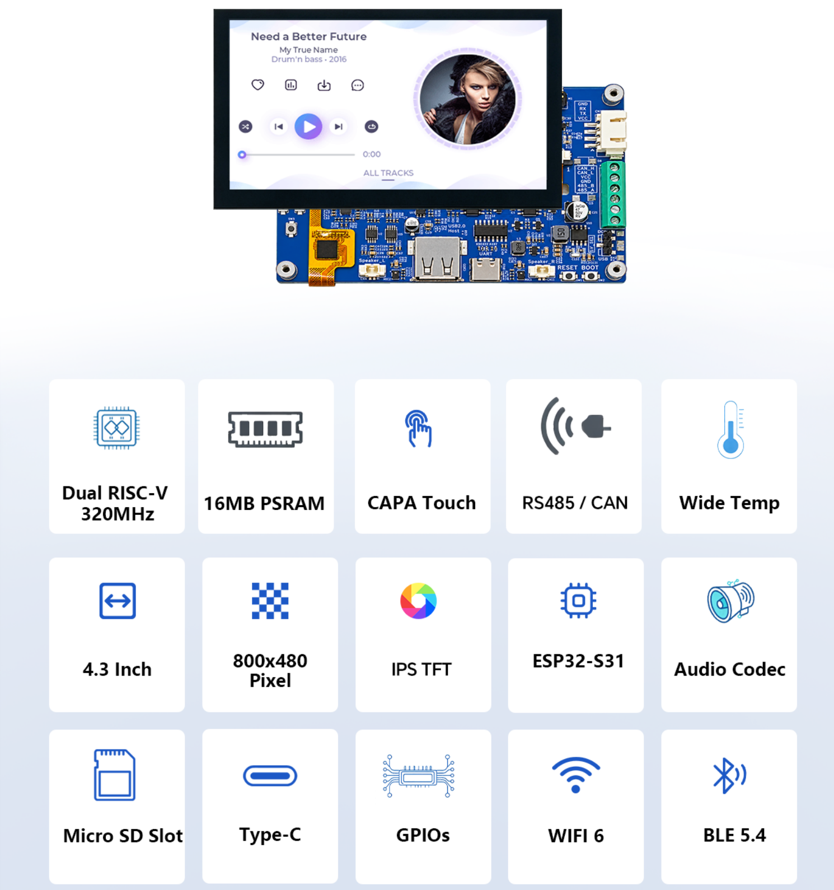
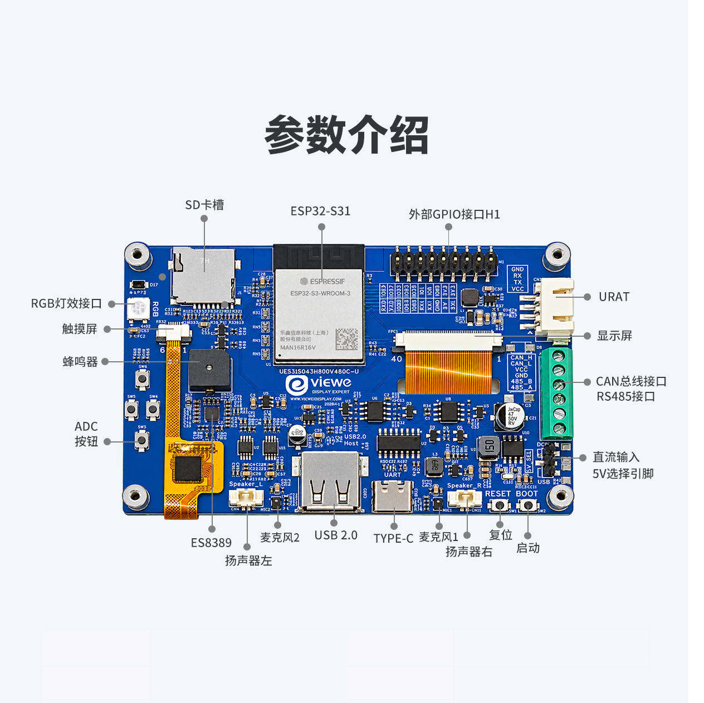
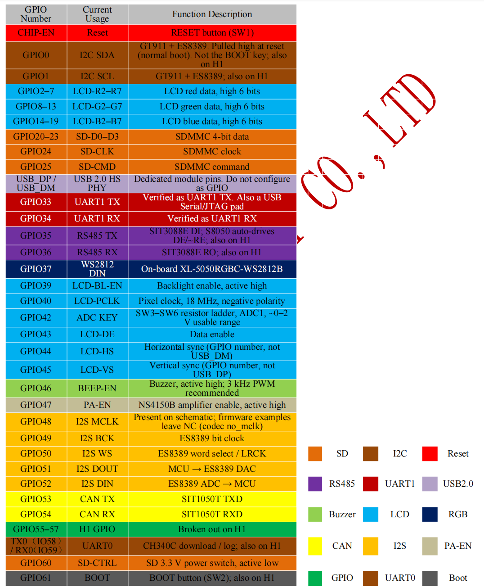
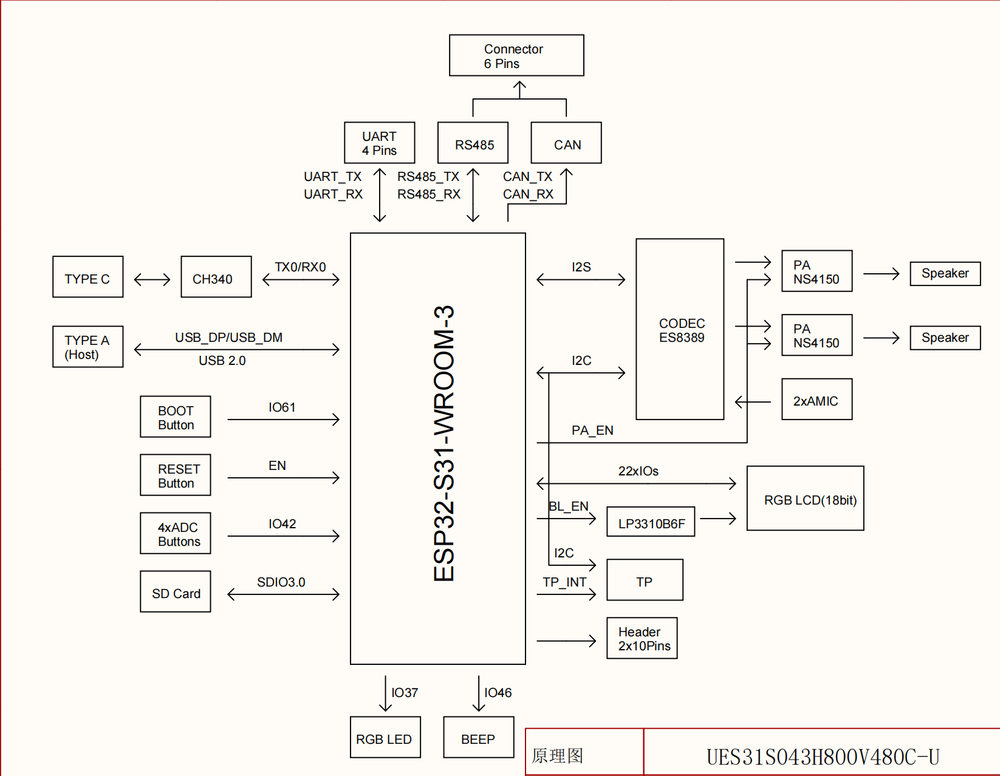

<h1 align="center">VIEWE 4.3" 800×480 ESP32-S31 智能显示模组快速指南</h1>

* **[English](./README.md)**

<p align="center">
    
</p>

---

## 1. 简介

PLCM-UES31S043H800V480C-U 是 VIEWE 设计的高性能智能显示模组。主控为乐鑫 ESP32-S31-WROOM-3，屏幕为 4.3 英寸 RGB 电容触摸屏（800 × 480）。液晶与触摸器件与 UEDX80480043E-WB-B 相同（驱动 IC 为 ST7262，触摸 IC 为 GT911）。主板按 ESP32-S31 重新设计：32 位 RISC-V 双核，主频最高 320 MHz，带 Wi-Fi 6、蓝牙 5.4（LE）与经典蓝牙、USB 2.0 High-Speed OTG、立体声音频、SDIO 3.0 存储，以及 RS485 / CAN 工业接口。

> [!NOTE]
> ESP32-S31 目前是预览芯片。ESP-IDF 编译必须带 `--preview`（例如 `idf.py --preview set-target esp32s31`）。模组额定参数以乐鑫 ESP32-S31-WROOM-3 数据手册（预发布）为准。本仓库示例说明写明：5.4、5.5 等稳定版不含这颗芯片，需要安装 ESP-IDF **master**。

### 1.1 产品特性

**CPU：**
- **处理器**
  - ESP32-S31 RISC-V 32 位双核，主频最高 320 MHz，另有 ULP-RISC-V 协处理器。
  - 2.4 GHz Wi-Fi 6（IEEE 802.11b/g/n/ax，HT20/40，最高 150 Mbps）、蓝牙 5.4 LE（含 LE Audio）、经典蓝牙（BR/EDR），以及 IEEE 802.15.4（Zigbee / Thread）。
  - 模组板载 PCB 天线。
  - 硬件安全：Secure Boot、Flash/PSRAM 加密、密码学加速、TEE。细节见芯片数据手册。
- **存储器**
  - 片内：320 KB ROM、512 KB SRAM、32 KB 低功耗 SRAM。
  - 本产品的典型模组配置：16 MB Quad SPI Flash + 16 MB Octal SPI PSRAM（ESP32-S31-WROOM-3-N16R16V）。
  - Flash 与 PSRAM 可并行访问。
- **外设接口**
  - USB Type-C：5 V 供电、固件下载、串口调试（CH340C 接到 UART0）。
  - USB Type-A：接到专用 USB 2.0 High-Speed OTG PHY（USB_DP / USB_DM，不是 GPIO）。Host 5 V 由 TPS2051C 提供（约 500 mA）。VBUS-EN 由硬件拉高，MCU 不能控制。
  - 板载 MicroSD 卡槽，4-bit SDMMC / SDIO 3.0。
  - ES8389 立体声编解码器、两路 NS4150B 功放、两路模拟麦克风，以及左右喇叭接口。
  - RS485（SIT3088E，硬件自动方向）和 CAN（SIT1050T + 片内 TWAI），出在 6 针端子上。
  - 2 × 10、2.54 mm 排针 H1，引出 UART0/UART1、I2C、RS485/CAN 相关 GPIO，以及 3.3 V / 5 V / GND。
  - 四路 ADC 按键、RESET / BOOT、WS2812B RGB 灯、3 kHz 无源蜂鸣器。

ESP32-S31-WROOM-3 的更多参数见 [相关文档](#5-相关文档) 中的模组数据手册。

**显示屏：**
- 尺寸：4.3 英寸
- 分辨率：800 × 480
- 像素排列：RGB 垂直条纹
- 接口：40PIN RGB 24bits
- 驱动 IC：ST7262E43-G4
- 触摸 IC：GT911
- 亮度：400 cd/m²
- 触摸：电容触摸（CTP）
- 已验证时序：PCLK 18 MHz，负极性；HSYNC 1 / 40 / 20；VSYNC 1 / 10 / 5
- 规格书中的屏体：IPS TFT，有效区 95.04 mm × 53.86 mm，模组功耗典型 1.04 W，16.2M 色

**其他：**
- 工作温度：−20 ~ 70 °C（受液晶限制）
- 存储温度：−30 ~ 80 °C
- MCU 模组额定温度：−40 ~ 85 °C
- 供电电压：典型 5.0 V
- 工作电流（VCC = +5 V）：最大背光时典型 320 mA、最大 500 mA；背光关闭时典型 100 mA
- 推荐电源：5 V 1 A 直流

### 1.2 应用领域

产品规格书列出的应用方向：

- 智能家居控制面板
- 工业自动化人机界面
- 智能家电
- 消费电子
- 无线数据记录
- 触摸屏界面
- 教学与实验平台

### 1.3 型号含义

| 字段 | 代码 | 含义 |
| --- | --- | --- |
| 形态 | PLCM | PCB + LCM（显示模组） |
| 品牌 / 系列 | UE | VIEWE 智能显示模组 |
| MCU | S31 | ESP32-S31-WROOM-3 |
| 尺寸 | S043 | 4.3 英寸 |
| 分辨率 | H800V480 | 800 × 480 |
| 触摸 | C | 电容触摸（GT911） |
| 总线 | U | UART / RS485 / I2C / CAN / USB 2.0 High-Speed OTG |

---

## 2. 产品信息

### 2.1 接口说明




1. **主控模组：** ESP32-S31-WROOM-3。RISC-V 双核，最高 320 MHz，16 MB Flash + 16 MB PSRAM，PCB 天线。
2. **显示接口：** 40 针 RGB。屏体支持 24 位；本板实际连接 RGB666（R2–R7 / G2–G7 / B2–B7）。见下方显示接口表。
3. **SD 卡槽：** 4-bit SDMMC。CLK = GPIO24，CMD = GPIO25，D0–D3 = GPIO20–23，SD_CTRL = GPIO60（低电平有效）。示例以 `SDMMC_FREQ_HIGHSPEED` 挂载 FAT。初始化主机前先把 GPIO60 拉低。
4. **触摸接口：** I2C 接 GT911（SDA = GPIO0，SCL = GPIO1，400 kHz），与 ES8389 共用。FPC 上有 INT（GPIO38）和 RST。规格书写明：已验证的示例未使用 INT 和 RST。
5. **USB Type-C：** 5 V 输入、下载和串口调试，经 CH340C（UART0）。先按住 BOOT（GPIO61），再点一下 RESET。
6. **USB Type-A：** USB 2.0 High-Speed OTG PHY（USB_DP / USB_DM）。Host 5 V 由 TPS2051C 提供。VBUS-EN 硬件拉高。Type-A 默认作为 USB Host 向外供 5 V。同一端口改作 Device 接到电脑时，不要两端同时给 VBUS 供电。
7. **UART 转接座（4 针，2.5 mm）：** GND / RX / TX / VCC，供外接串口模块。
8. **RGB 灯（WS2812B）：** 一颗 XL-5050RGBC-WS2812B，DIN = GPIO37，由 5 V 经电平转换供电。
9. **Boot 按键：** BOOT（GPIO61，SW2），用于下载模式。同时引出到 H1。
10. **复位按键：** RESET（CHIP-EN，SW1）。
11. **外部排针 H1：** 2 × 10、2.54 mm。见 H1 表。
12. **工业端子 CN3（CAN / RS485）：** CAN_H、CAN_L、VCC、GND、485_B、485_A。以 PCB 丝印为准。
13. **音频：** 喇叭 L / R（CN2 / CN1），2 针 1.25 mm；板载麦克风 MIC1 / MIC2。编解码器 ES8389，功放 NS4150B。
14. **ADC 按键：** SW3–SW6，接在 GPIO42。
15. **蜂鸣器：** BEEP_EN = GPIO46，高电平打开，无源，3 kHz。
16. **DCIN / 5V_SEL：** 外部 5 V 输入，以及 5 V 来源选择跳线。

#### 显示接口

| 引脚 | 符号 | I/O | 说明 |
| --- | --- | --- | --- |
| 1 | LEDK | P | 背光阴极 |
| 2 | LEDA | P | 背光阳极 |
| 3 | GND | P | 电源地 |
| 4 | VDD | P | 逻辑电源，3.3 V |
| 5–12 | R0–R7 | I | 红色数据。本板使用 R2–R7（GPIO2–7）。R0/R1 = NC |
| 13–20 | G0–G7 | I | 绿色数据。本板使用 G2–G7（GPIO8–13）。G0/G1 = NC |
| 21–28 | B0–B7 | I | 蓝色数据。本板使用 B2–B7（GPIO14–19）。B0/B1 = NC |
| 29 | GND | P | 电源地 |
| 30 | CLK | I | 像素时钟，负极性（GPIO40） |
| 31 | DISP | I | 待机。通常拉高 |
| 32 | HSYNC | I | 行同步，负极性（GPIO44） |
| 33 | VSYNC | I | 场同步，负极性（GPIO45） |
| 34 | DEN | I | 数据使能。DE 为 “H” 时允许显示（GPIO43） |
| 35 | NC | I | 空脚 |
| 36 | GND | P | 电源地 |
| 37 | XR | - | 空脚 |
| 38 | YD | - | 空脚 |
| 39 | XL | - | 空脚 |
| 40 | YU | - | 空脚 |

*I：输入；O：输出；P：电源*

已验证的 RGB 时序：

| 参数 | 数值 |
| --- | --- |
| PCLK | 18 MHz，`pclk_active_neg = true` |
| 水平分辨率 | 800 |
| 垂直分辨率 | 480 |
| HSYNC 脉宽 / 后沿 / 前沿 | 1 / 40 / 20 |
| VSYNC 脉宽 / 后沿 / 前沿 | 1 / 10 / 5 |
| 帧缓冲 | PSRAM 中 RGB888，单缓冲 |

#### 触摸接口

| 引脚 | 符号 | I/O | 说明 |
| --- | --- | --- | --- |
| 1 | RST | P | FPC 上的触摸复位；未使用 |
| 2 | 3.3V | P | 3.3 V 逻辑电源 |
| 3 | GND | P | 电源地 |
| 4 | INT | I | FPC 上的触摸中断。TP INT = GPIO38 |
| 5 | SDA | I | SDA = GPIO0，与 ES8389 共用 |
| 6 | SCL | P | SCL = GPIO1，400 kHz，与 ES8389 共用 |

#### H1 排针（2 × 10，2.54 mm，自上而下）

| 序号 | 左侧 | 序号 | 右侧 |
| --- | --- | --- | --- |
| 1 | 3V3 | 2 | 5V |
| 3 | 3V3 | 4 | 5V |
| 5 | GND | 6 | GND |
| 7 | GPIO0 (SDA) | 8 | TX1 (GPIO33) |
| 9 | GPIO1 (SCL) | 10 | RX1 (GPIO34) |
| 11 | GPIO35 (485_TX) | 12 | GPIO36 (485_RX) |
| 13 | GPIO53 (CAN_TX) | 14 | GPIO54 (CAN_RX) |
| 15 | GPIO55 | 16 | GPIO56 |
| 17 | GPIO57 | 18 | TX0 |
| 19 | GPIO61 (BOOT) | 20 | RX0 |

H1 上的 GPIO35/36 和 GPIO53/54 与板载 RS485、CAN 收发器并联。不要同时从排针和端子驱动这两路。GPIO0/1 已有 I2C 上拉。

#### UART / RS485 / CAN

| 接口 | 控制器 | MCU 引脚 | 对外 | 已验证配置 |
| --- | --- | --- | --- | --- |
| UART0 | CH340C | TX0 (IO58) / RX0 (IO59) | Type-C / H1 | 下载与监视 |
| UART1 | GPIO 矩阵 | TX = 33，RX = 34 | H1 TX1 / RX1 | 115200 8N1 |
| RS485 | SIT3088E + UART2 | TX = 35，RX = 36 | CN3 485_A / 485_B / GND | 115200 8N1，自动 DE |
| CAN | SIT1050T + TWAI | TX = 53，RX = 54 | CN3 CAN_H / CAN_L / GND | 500 kbit/s，经典 CAN |

| CN3 丝印 | 功能 |
| --- | --- |
| CAN_H | CAN 高 |
| CAN_L | CAN 低 |
| VCC | 5 V。当作电源使用前先确认跳线和负载 |
| GND | 公共地 |
| 485_B | RS485 B |
| 485_A | RS485 A |

RS485：DE/~RE 由 485_TX 经 S8050 自动切换。软件里按普通 UART 使用，不要配置 RTS。板上有 120 Ω 终端，以及 A 上拉 / B 下拉。CAN：板上有 120 Ω 终端；CAN_GND 经 0 Ω 接到系统地。不要把 USB-TTL 接到 A/B 或 CAN_H/L。

#### 音频

音频编解码器为 Everest ES8389（I2C 7 位地址 0x20）。使用 I2S0 全双工。48 kHz / 16-bit / 立体声播放和录音已验证。不需要 MCLK（编解码器配置为 `no_mclk`）。两路 NS4150B D 类功放驱动左右喇叭。PA_EN = GPIO47。MIC1、MIC2 为板载模拟麦克风。

| 信号 | GPIO / 器件 | 说明 |
| --- | --- | --- |
| I2C SDA / SCL | GPIO0 / GPIO1 | 与 GT911 共用，400 kHz |
| I2S BCK | GPIO49 | 位时钟 |
| I2S WS | GPIO50 | 字选择 / LRCK |
| I2S DOUT | GPIO51 | DAC 播放 |
| I2S DIN | GPIO52 | ADC 录音 |
| I2S MCLK | 固件中为 NC | 原理图上可选 |
| PA_EN | GPIO47 | 高电平打开放大器 |
| 喇叭 | CN1 / CN2 | NS4150B 差分输出，典型 4 Ω / 3 W 等级 |

#### ADC 按键（实板测量）

| 按键 | 典型电压 | 软件窗口 | 备注 |
| --- | --- | --- | --- |
| 空闲 | ≈ 3.3 V（上拉） | 饱和 / 空闲 | S31 ADC 0 dB 约 0–2 V，空闲时饱和 |
| SW3 | ≈ 0.38 V | 100–600 mV | GPIO42 |
| SW4 | ≈ 0.82 V | 600–1080 mV | GPIO42 |
| SW5 | ≈ 1.34 V | 1080–1605 mV | GPIO42 |
| SW6 | ≈ 1.87 V | 1605–2200 mV | GPIO42 |

分压结构不能同时识别两个按键。规格书写明：部分图纸上的丝印顺序与实测电压不一致，以上表为准。

### 2.2 GPIO 定义



> [!Note]
> 绿色标记的**GPIO**引脚为空闲输入输出引脚，没有被任何功能占用。

---

## 3. 功能框图



> **注意：** ESP32-S31 的 2.4 GHz 射频支持 Wi-Fi 6、蓝牙 5.4（LE）、经典蓝牙和 802.15.4。它们共用同一射频前端，Wi-Fi 与蓝牙不能同时收发，射频会按需在协议之间切换。USB 2.0 High-Speed 是独立 PHY，不共用该射频前端。

---

## 4. 软件

本仓库提供 **ESP-IDF** 示例。没有 Arduino 示例，也没有 PlatformIO 示例。

工程使用乐鑫组件仓库中的板级支持包 **[viewesmart/bsp_ues31s043h800v480c_u](https://components.espressif.com/components/viewesmart/bsp_ues31s043h800v480c_u)**（`^1.0.0`）。各示例的组件清单还声明了 `idf >= 5.5.0`。示例说明要求安装 ESP-IDF **master** 并加上 `--preview`，因为带版本号的稳定版不含 `esp32s31`。

### 4.1 软件示例

示例在 [`examples/esp-idf`](examples/esp-idf)。每个带编号的文件夹都是独立工程。总表：[examples/esp-idf/README_CN.md](examples/esp-idf/README_CN.md)。

| 框架 | 示例路径 | 说明 |
| --- | --- | --- |
| **ESP-IDF** | [`examples/esp-idf/01_display_touch`](examples/esp-idf/01_display_touch) | 屏幕、GT911、背光 |
| **ESP-IDF** | [`examples/esp-idf/02_audio_speaker`](examples/esp-idf/02_audio_speaker) | ES8389 喇叭 |
| **ESP-IDF** | [`examples/esp-idf/03_audio_mic`](examples/esp-idf/03_audio_mic) | 麦克风录音到 SD |
| **ESP-IDF** | [`examples/esp-idf/04_sdcard`](examples/esp-idf/04_sdcard) | TF / SDMMC |
| **ESP-IDF** | [`examples/esp-idf/05_adc_buttons`](examples/esp-idf/05_adc_buttons) | 按键 SW3–SW6 |
| **ESP-IDF** | [`examples/esp-idf/06_uart1`](examples/esp-idf/06_uart1) | UART1 GPIO33/34 回环 |
| **ESP-IDF** | [`examples/esp-idf/07_rs485`](examples/esp-idf/07_rs485) | RS485 GPIO35/36 |
| **ESP-IDF** | [`examples/esp-idf/08_can`](examples/esp-idf/08_can) | CAN GPIO53/54 |
| **ESP-IDF** | [`examples/esp-idf/09_wifi_sta`](examples/esp-idf/09_wifi_sta) | Wi-Fi 6 站点 |
| **ESP-IDF** | [`examples/esp-idf/10_ble_gatt`](examples/esp-idf/10_ble_gatt) | BLE HID 遥控器（`S31-BSP-HID`） |
| **ESP-IDF** | [`examples/esp-idf/11_bt_spp`](examples/esp-idf/11_bt_spp) | BLE 串口回显（`S31-BSP-UART`） |
| **ESP-IDF** | [`examples/esp-idf/12_usb_hid`](examples/esp-idf/12_usb_hid) | 触摸当作 USB 鼠标 |
| **ESP-IDF** | [`examples/esp-idf/13_led_buzzer`](examples/esp-idf/13_led_buzzer) | WS2812 + 蜂鸣器 |
| **ESP-IDF** | [`examples/esp-idf/14_avi_player`](examples/esp-idf/14_avi_player) | SD 卡 AVI + JPEG + 喇叭 |
| **ESP-IDF** | [`examples/esp-idf/15_mp4_player`](examples/esp-idf/15_mp4_player) | SD 卡 MP4/MJPEG + AAC + 喇叭 |
| **ESP-IDF** | [`examples/esp-idf/16_sd_music`](examples/esp-idf/16_sd_music) | SD 卡 MP3 + LVGL 播放器 |
| **ESP-IDF** | [`examples/esp-idf/17_bt_audio`](examples/esp-idf/17_bt_audio) | 经典蓝牙 A2DP / HFP + LVGL（`S31-BT-AUDIO`） |
| **ESP-IDF** | [`examples/esp-idf/18_lvgl`](examples/esp-idf/18_lvgl) | LVGL 控件 + 触摸 |

烧录 `09_wifi_sta` 之前，把 `main/main.c` 里的 `EXAMPLE_WIFI_SSID` 和 `EXAMPLE_WIFI_PASSWORD` 改成你自己的 2.4 GHz 热点。

`17_bt_audio` 在执行 `idf.py` 之前要设置下面这一行，并且不要执行 `idf.py bmgr`：

```powershell
$env:SDKCONFIG_DEFAULTS = "sdkconfig.defaults;sdkconfig.defaults.esp32s31.classic"
```

接着编译 BLE 示例之前，把这个变量清掉。BLE（`10`、`11`）和经典蓝牙（`17`）不能做进同一份固件。

### 4.2 入门

#### 4.2.1 准备

* **硬件：** PLCM-UES31S043H800V480C-U，能传数据的 USB 线，接到 Type-C（CH340）。
* **软件：** 用 [EIM](https://dl.espressif.com/dl/eim/index.html) 安装 ESP-IDF **master**。中国大陆请点该页的 **Download**。VS Code 和乐鑫 ESP-IDF 插件可以选装。示例说明写明不要用带版本号的稳定版来做这块板。
* 每个示例 README 开头都有完整步骤，例如 [examples/esp-idf/01_display_touch/README_CN.md](examples/esp-idf/01_display_touch/README_CN.md)。

#### 4.2.2 ESP-IDF 环境

1. **安装 ESP-IDF master**
   * 安装 EIM，然后安装 **master**。不要选带版本号的稳定版。
   * 打开路径里带 `master` 的 ESP-IDF 终端。
   * 确认工具链：

```powershell
idf.py --version
idf.py --preview --list-targets
```

   * `idf.py --version` 的路径里要有 `master`。目标列表里要有 `esp32s31`。
2. **只打开一个示例文件夹**
   * 每个带编号的文件夹都是独立工程。不要在 `examples/` 或 `examples/esp-idf` 里直接编译。
   * 例如：`examples/esp-idf/01_display_touch`。
3. **编译、烧录、监视**
   * 接上 USB Type-C，选中 **USB-SERIAL CH340** 对应的端口（下面的 `COMx`）。
   * 在该示例目录中执行：

```powershell
idf.py --preview set-target esp32s31
idf.py --preview -p COMx flash monitor
```

   * 第一次编译会从 `components.espressif.com` 下载组件，其中包括 `viewesmart/bsp_ues31s043h800v480c_u`。监视器波特率 115200。
   * 烧录成功时日志依次出现 **100%**、**Hash of data verified**、**Hard resetting via RTS pin...**，然后是 `Project name:` 加该文件夹名。按 `Ctrl+]` 退出监视器。

目标列表里没有 `esp32s31`，就是没装到 master，或者命令漏了 `--preview`。

---

## 5. 相关文档

- [产品规格书 V1.0（PDF）](datasheet/PLCM-UES31S043H800V480C-U%20V1.0%20SPEC.pdf)
- [产品规格书 V1.0（DOC）](datasheet/PLCM-UES31S043H800V480C-U%20V1.0%20SPEC.doc)
- [原理图（PDF）](schematic/SCH_UES31S043H800V480C-U_2026-08-17.pdf)
- [2D 图纸（DWG）](2D_diagram/PLCM-UES31S043H800V480-U.dwg)
- [显示屏规格书 UE043WV-RB40-A070A V1.0（PDF）](datasheet/display/UE043WV-RB40-A070A_V1.0.pdf)
- [ST7262 数据手册 V0.4（PDF）](datasheet/display/1_ST7262_V0.4_201812.pdf)
- [GT911 数据手册（中文）](datasheet/display/GT911_CN_Datasheet.pdf)
- [GT911 数据手册（英文）](datasheet/display/GT911_EN_Datasheet.pdf)
- [ESP32-S31-WROOM-3 数据手册（中文）](datasheet/s31/esp32-s31-wroom-3_wroom-3u_datasheet_cn.pdf)
- [ESP32-S31-WROOM-3 数据手册（英文）](datasheet/s31/esp32-s31-wroom-3_wroom-3u_datasheet_en.pdf)

---

## 6. 常见问题

* Q. 看完上面的步骤，还是不会搭环境，怎么办？
* A. 按 [examples/esp-idf/README_CN.md](examples/esp-idf/README_CN.md) 开头的安装说明做。也可以参考 [VIEWE-FAQ](https://github.com/VIEWESMART/VIEWE-FAQ)。

* Q. 目标列表里为什么没有 `esp32s31`？
* A. 示例说明写明这颗芯片只在 ESP-IDF **master** 里，而且命令必须带 `--preview`。5.4、5.5 这类带版本号的稳定版不会列出 `esp32s31`。用 EIM 重装 master，再执行 `idf.py --preview --list-targets`。

* Q. 为什么一直下载失败？
* A. 下载口是 Type-C（CH340，UART0）。按住 BOOT（GPIO61），再点一下 RESET，然后重新下载。同时关掉还开着的监视器，并核对 CH340 的 COM 口。USB Type-A 是 USB 2.0 High-Speed OTG，不是下载口。

* Q. 外部串口座没有日志，是不是坏了？
* A. 下载和默认日志走 Type-C 上的 CH340C，对应 UART0（TX0 / RX0，IO58 / IO59）。UART1 在 H1 上，TX 为 GPIO33，RX 为 GPIO34，115200 8N1。不要把 USB-TTL 接到 RS485 的 A/B 或 CAN 的 CAN_H/L。

* Q. BLE 和经典蓝牙能放在同一份固件里吗？
* A. 不能。示例总表写明 BLE（`10_ble_gatt`、`11_bt_spp`）和经典蓝牙（`17_bt_audio`）不能做进同一份固件。编译过 `17_bt_audio` 之后，再编译 BLE 示例前要清掉 `SDKCONFIG_DEFAULTS`。
